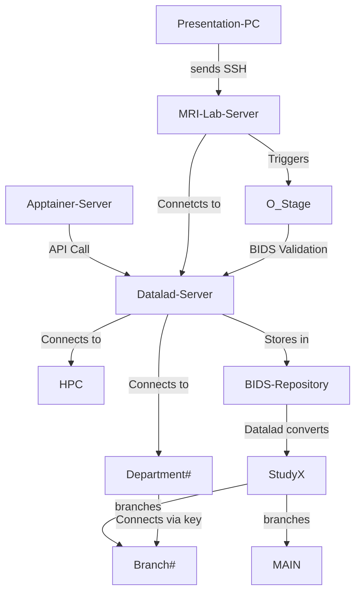

# datalad

## Overview of network

```mermaid

graph TD
  Apptainer-Server -->|API Call| Datalad-Server
  Presentation-PC -->|sends SSH| MRI-Lab-Server
  MRI-Lab-Server -->|Connetcts to| Datalad-Server
  MRI-Lab-Server -->|Triggers| O_Stage
  O_Stage -->|BIDS Validation| Datalad-Server

  Datalad-Server -->|Connects to| HPC
  Datalad-Server -->|Connects to| Department#
  Datalad-Server -->|Stores in| BIDS-Repository
  BIDS-Repository -->|Datalad converts| StudyX
  StudyX -->|branches| MAIN
  StudyX -->|branches| Branch#
  Department# -->|Connects via key| Branch#

```
